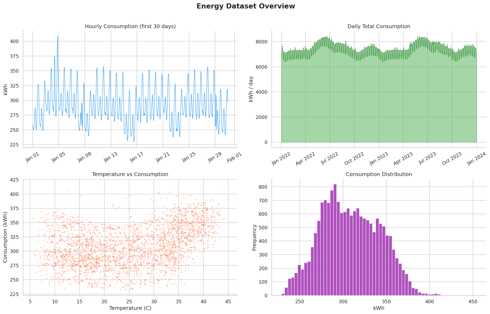
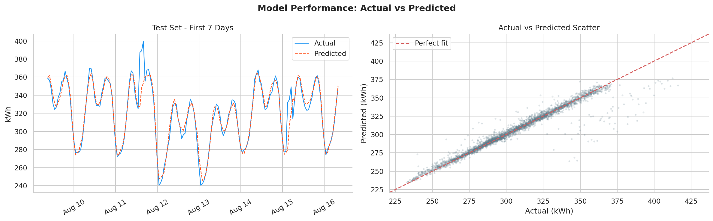
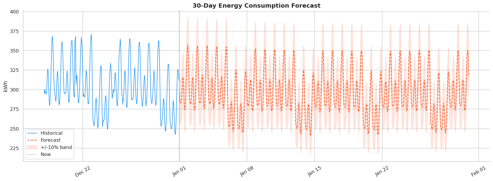
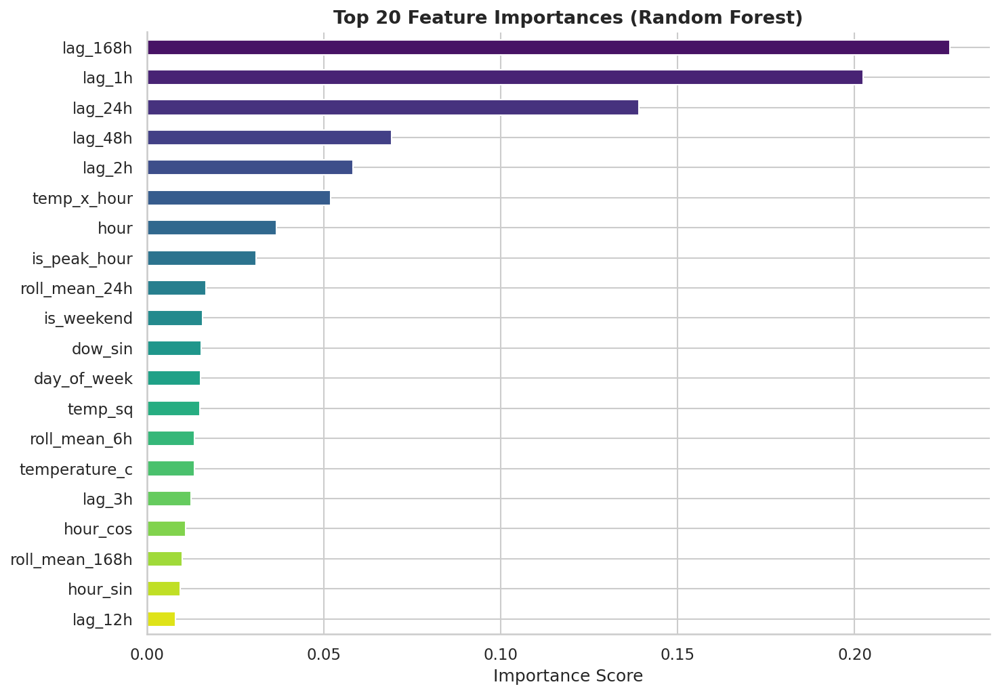
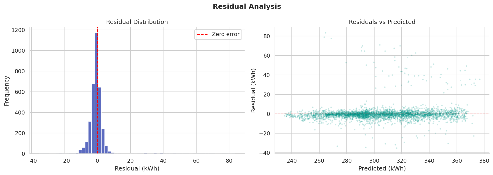

# AI-Powered Energy Consumption Forecasting

An end-to-end machine learning project for forecasting hourly energy consumption using historical usage patterns, weather-related variables, engineered time-series features, and an interactive Streamlit dashboard.

## Overview

This project:

1. Loads raw energy data from `data/raw/energy_data.csv`
2. Preprocesses and cleans the time-series data
3. Engineers time-based and lag-based features
4. Trains a Random Forest forecasting model
5. Evaluates the model with multiple metrics
6. Forecasts the next 30 days of energy demand
7. Saves processed files, graphs, model artifacts, and forecast outputs
8. Displays everything in an interactive dashboard

## Project Structure

```text
AI-Energy-Forecasting/
├─ data/
│  ├─ raw/
│  │  └─ energy_data.csv
│  └─ processed/
│     ├─ energy_clean.csv
│     └─ energy_features.csv
├─ notebooks/
│  ├─ 01eda.ipynb
│  └─ 02_model_training.ipynb
├─ src/
│  ├─ main.py
│  ├─ model.py
│  ├─ data_loader.py
│  ├─ feature_engineering.py
│  ├─ Preprocessing.py
│  ├─ Visualization.py
│  └─ Utils.py
├─ models/
│  └─ rf_energy_model.pkl
├─ outputs/
│  ├─ forecast_30days.csv
│  ├─ metrics.txt
│  └─ graphs/
│     ├─ 01_raw_data_overview.png
│     ├─ 02_actual_vs_predicted.png
│     ├─ 03_30day_forecast.png
│     ├─ 04_feature_importance.png
│     └─ 05_residual_analysis.png
├─ dashboard.py
├─ Architecture.md
├─ Readme.md
└─ requirements.txt
```

## Technologies Used

- Python
- Pandas
- NumPy
- Scikit-learn
- Matplotlib
- Seaborn
- Joblib
- Plotly
- Streamlit

## Pipeline Modules

### `src/main.py`

Runs the complete pipeline from data loading to forecasting and graph generation.

### `src/data_loader.py`

Loads the raw dataset if available or generates a synthetic energy dataset automatically.

### `src/Preprocessing.py`

Handles:
- datetime conversion
- hourly resampling
- missing value handling
- outlier capping
- smoothing

### `src/feature_engineering.py`

Creates:
- calendar features
- cyclical encodings
- lag features
- rolling statistics
- temperature interaction features

### `src/model.py`

Handles:
- model training
- time-based train/test split
- evaluation metrics
- future recursive forecasting

### `src/Visualization.py`

Generates and saves output graphs in:

- `outputs/graphs/01_raw_data_overview.png`
- `outputs/graphs/02_actual_vs_predicted.png`
- `outputs/graphs/03_30day_forecast.png`
- `outputs/graphs/04_feature_importance.png`
- `outputs/graphs/05_residual_analysis.png`

### `dashboard.py`

Launches the interactive dashboard with:
- metallic robo-style UI
- KPI cards
- forecast analysis
- anomaly view
- demand heatmap
- feature relationship chart
- data explorer and downloads

## How To Run

### 1. Create and activate virtual environment

```powershell
python -m venv .venv
.\.venv\Scripts\Activate
```

### 2. Install dependencies

```powershell
pip install -r requirements.txt
```

### 3. Run the forecasting pipeline

```powershell
python src/main.py
```

### 4. Launch the interactive dashboard

```powershell
streamlit run dashboard.py
```

## Generated Outputs

After running `python src/main.py`, the following files are generated:

### Raw and Processed Data

- `data/raw/energy_data.csv`
- `data/processed/energy_clean.csv`
- `data/processed/energy_features.csv`

### Model Artifact

- `models/rf_energy_model.pkl`

### Evaluation and Forecast

- `outputs/metrics.txt`
- `outputs/forecast_30days.csv`

### Graph Outputs

- `outputs/graphs/01_raw_data_overview.png`
- `outputs/graphs/02_actual_vs_predicted.png`
- `outputs/graphs/03_30day_forecast.png`
- `outputs/graphs/04_feature_importance.png`
- `outputs/graphs/05_residual_analysis.png`

## Output Preview

### 1. Raw Data Overview

`outputs/graphs/01_raw_data_overview.png`



### 2. Actual vs Predicted

`outputs/graphs/02_actual_vs_predicted.png`



### 3. 30-Day Forecast

`outputs/graphs/03_30day_forecast.png`



### 4. Feature Importance

`outputs/graphs/04_feature_importance.png`



### 5. Residual Analysis

`outputs/graphs/05_residual_analysis.png`



## Model Performance

Current evaluation results from `outputs/metrics.txt`:

- RMSE: `7.5042`
- MAE: `3.2272`
- R2: `0.9428`
- MAPE: `1.0200%`

## Dashboard Features

The Streamlit dashboard includes:

- historical vs forecast visualization
- monthly and daily demand trends
- weekly demand heatmap
- average hourly load profile
- anomaly detection panel
- feature relationship view
- processed data and forecast tables
- CSV download buttons

## Use Case

This project is suitable for:

- academic mini projects
- diploma or final-year presentations
- machine learning demonstrations
- forecasting dashboard demos
- smart energy analytics prototypes

## Notes

- If `data/raw/energy_data.csv` is missing, the project auto-generates a synthetic dataset.
- All final chart outputs are saved under `outputs/graphs/`.
- The dashboard reads the generated CSV and metrics files directly.
